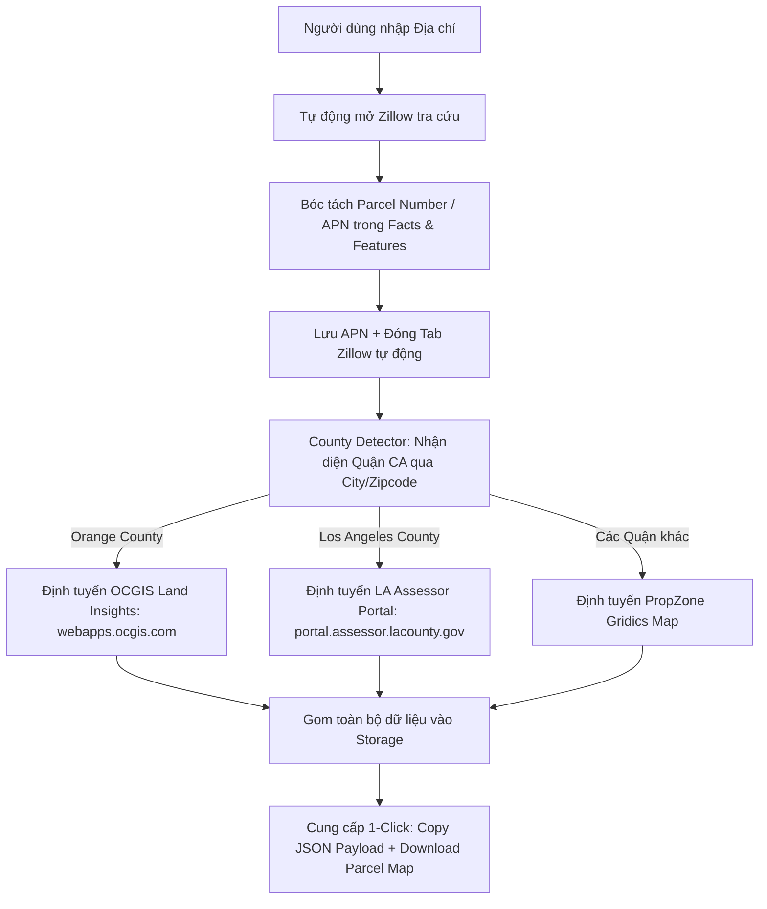

# Kế Hoạch Triển Khai: Auto Feasibility Study Pipeline & Parcel Map Downloader

Tài liệu này xác định quy trình tự động hóa đa cổng (Multi-portal Automation Pipeline) từ địa chỉ đầu vào đến việc trích xuất số APN, nhận diện County của California, tổng hợp dữ liệu và tải bản đồ Parcel Map.

---

## 1. Quy Trình Tự Động Hóa 4 Bước (Pipeline Workflow)

---

## 2. Các Module Kỹ Thuật

1. **`background/service-worker.js`**:
   - Điều phối tab tự động (Automation Runner).
   - Mở Zillow -> chờ load DOM -> lấy APN -> đóng tab -> mở cổng County tương ứng.
2. **`config/county-detector.js`**:
   - Bộ từ điển nhận diện Quận của California dựa theo tên Thành Phố và Mã Bưu Chính (Zipcode).
   - Tự động phân biệt Orange County (Westminster, Garden Grove, Irvine, Anaheim...) và Los Angeles County (Lancaster, Los Angeles, Pasadena...).
3. **`content/zillow-extractor.js`**:
   - Bóc tách `Parcel number` trong mục Details / Facts & Features của Zillow.
4. **`popup/` (Executive UI)**:
   - Nút chạy tự động `Auto Fetch ⚡`
   - Hiển thị thông tin Quận đã phát hiện
   - 2 nút ở Footer: `Copy JSON Payload` và `Download Parcel Map`.
