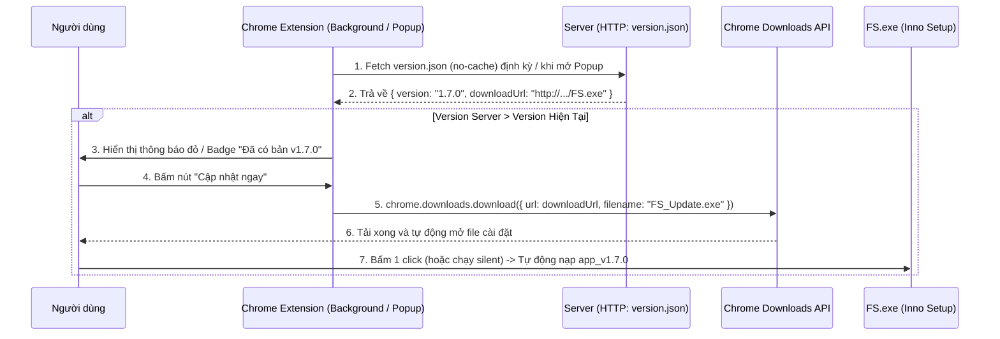
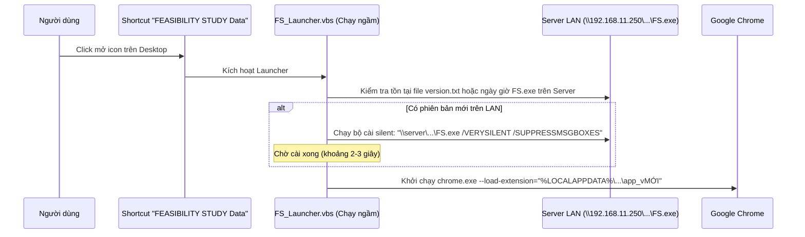

# KẾ HOẠCH & GIẢI PHÁP ĐÓNG GÓI BỘ CÀI ĐẶT & TỰ ĐỘNG CẬP NHẬT CHROME EXTENSION (UNPACKED)

## 1. Bối cảnh & Mục tiêu
- **Dự án**: Chrome Extension `FEASIBILITY STUDY Data` (chạy dạng unpacked với cờ `--load-extension`).
- **Mục tiêu**: 
  - Tạo bộ cài đặt dạng file thực thi duy nhất (`FS.exe`) bằng **Inno Setup**, cài đặt nhanh chỉ với 1 cú click (không cần quyền Administrator).
  - Tự động giải nén mã nguồn vào thư mục `%LOCALAPPDATA%\FEASIBILITY_STUDY_Data\app_v{VERSION}`.
  - Khi cập nhật phiên bản mới: tự động xóa bản cũ, nạp bản mới vào thư mục mới tương ứng để Chrome làm mới hoàn toàn; **tuyệt đối không can thiệp** vào thư mục Cache/Session/Cookie của Chrome.
  - Tự động tạo/cập nhật Shortcut trên Desktop trỏ đến `chrome.exe` kèm cờ nạp extension.
  - Giải quyết bài toán: **Làm sao để máy client / Extension biết trên Server đang có bản cập nhật mới**.

---

## 2. Giải Pháp Phát Hiện Phiên Bản Mới Trên Server (Server Update Detection)

Đây là bài toán trọng tâm vì Chrome Extension chạy trong môi trường sandbox của trình duyệt. Dựa trên hạ tầng thực tế (Server mạng nội bộ LAN `\\192.168.11.250\...` hoặc Web Server), chúng ta có 2 phương án tối ưu:

### 🌟 Phương Án A (Khuyến Nghị - Chuẩn Web / HTTP API)
*Áp dụng nếu Server triển khai 1 Web Server nội bộ siêu nhẹ (IIS, Nginx, hoặc file server chạy port 80/8080) hoặc qua Cloudflare / GitHub.*



- **File trên Server**: `version.json`
  ```json
  {
    "version": "1.7.0",
    "releaseDate": "2026-09-20",
    "installerUrl": "http://192.168.11.250:8080/Tools/FS/FS.exe",
    "changelog": "Cập nhật bóc tách bản đồ San Bernardino và OC"
  }
  ```
- **Ưu điểm**: Hoạt động hoàn toàn tự nhiên bên trong Chrome Extension, người dùng thấy thông báo trực quan trên Extension Popup.

---

### 🚀 Phương Án B (Khuyến Nghị Cho Mạng Nội Bộ LAN SMB Share `\\192.168.11.250\...`)
*Áp dụng khi bộ cài chỉ đặt trên thư mục chia sẻ mạng LAN Windows (SMB file share), Extension không thể trực tiếp đọc `file://` do bảo mật sandbox.*

Thay vì Shortcut trên Desktop trỏ trực tiếp vào `chrome.exe`, Shortcut sẽ gọi qua một launcher kiểm tra cập nhật siêu tốc (`FS_Launcher.vbs` - chạy ngầm 0.2s không hiện cửa sổ đen cmd):



- **Ưu điểm**: Hoàn toàn tự động 100%, người dùng chỉ việc bấm icon phần mềm trên Desktop, nếu IT vừa up bản mới lên server, máy client tự âm thầm cập nhật ngay lập tức trước khi Chrome bật lên.

---

## 3. Kiến Trúc Bộ Cài Đặt Inno Setup (`FS.iss`)

### 3.1. Cấu Trúc Thư Mục Triển Khai Trên Máy Client
```
%LOCALAPPDATA%\FEASIBILITY_STUDY_Data\
  ├── app_v1.6.0\               <-- Bản cũ (sẽ bị xóa khi lên bản mới)
  ├── app_v1.7.0\               <-- Bản mới nạp vào đây
  │     ├── manifest.json
  │     ├── background\
  │     ├── content\
  │     ├── popup\
  │     └── icons\
  ├── FS.ico                    <-- Icon nhận diện cho Shortcut
  └── unins000.exe              <-- Trình gỡ cài đặt sạch
```

### 3.2. Thuật Toán Xóa Bản Cũ An Toàn & Bảo Vệ Chrome User Data
- **Vấn đề cốt lõi**: Không được làm mất cookie, session, lịch sử web của người dùng trong `%LOCALAPPDATA%\Google\Chrome\User Data`.
- **Giải pháp**:
  - Script Inno Setup **chỉ hoạt động bên trong phạm vi thư mục cài đặt riêng**: `{localappdata}\FEASIBILITY_STUDY_Data`.
  - Trong sự kiện `CurStepChanged(ssInstall)`:
    - Tìm kiếm toàn bộ các thư mục con có tiền tố `app_v*`.
    - So sánh với tên thư mục hiện tại (`app_v{#MyAppVersion}`).
    - Xóa đệ quy toàn bộ thư mục `app_v*` cũ bằng lệnh `DelTree`.
  - Giải nén mã nguồn mới vào thư mục `{localappdata}\FEASIBILITY_STUDY_Data\app_v{#MyAppVersion}`.

### 3.3. Thuật Toán Tự Động Dò Tìm `chrome.exe` & Tạo Shortcut
Inno Setup Pascal Script sẽ dò tìm đường dẫn Chrome theo thứ tự ưu tiên:
1. `HKLM\SOFTWARE\Microsoft\Windows\CurrentVersion\App Paths\chrome.exe`
2. `HKCU\SOFTWARE\Microsoft\Windows\CurrentVersion\App Paths\chrome.exe`
3. `%ProgramFiles%\Google\Chrome\Application\chrome.exe`
4. `%ProgramFiles(x86)%\Google\Chrome\Application\chrome.exe`
5. `%LOCALAPPDATA%\Google\Chrome\Application\chrome.exe`

Sau đó tạo Shortcut trên `{userdesktop}`:
- **Target**: Đường dẫn `chrome.exe` tìm được.
- **Parameters**: `"--load-extension=""{code:GetExtensionDir}"""`
- **Icon**: `{app}\FS.ico`
- **WorkingDir**: Thư mục chứa Chrome.

---

## 4. Logic Nội Bộ Trong Service Worker (`background/service-worker.js`)

Khi Chrome phát hiện extension được load lại từ đường dẫn mới hoặc phiên bản mới được kích hoạt:
1. Lắng nghe `chrome.runtime.onInstalled`:
   - Kiểm tra `details.reason === 'update'`.
   - Log thông tin phiên bản cũ (`details.previousVersion`) -> phiên bản mới.
   - Tự động migrate hoặc dọn dẹp các key tạm không còn tương thích trong `chrome.storage.local`.
   - Gọi `chrome.runtime.reload()` (kèm cờ chặn loop) để Chrome xóa triệt để cache bytecode trong RAM và nạp mới 100% từ ổ đĩa.
2. Thêm module kiểm tra phiên bản định kỳ với Server (`checkServerVersion()`).

---

## 5. Danh Sách Các File Cần Triển Khai & Cập Nhật

| Thao Tác | Đường Dẫn File | Mô Tả |
|---|---|---|
| **CẬP NHẬT** | `FEASIBILITY STUDY Data/Build/Deploy/Installer/FS.iss` | Script Inno Setup hoàn chỉnh đáp ứng đầy đủ yêu cầu xóa bản cũ, tạo shortcut Chrome, chạy silent |
| **TẠO MỚI** | `FEASIBILITY STUDY Data/Build/Build_Installer.bat` | Script 1-click tự động lấy version từ manifest.json và biên dịch ra `FS.exe` |
| **CẬP NHẬT** | `FEASIBILITY STUDY Data/background/service-worker.js` | Bổ sung `onInstalled` update handler + logic kiểm tra phiên bản mới từ server |
| **CẬP NHẬT** | `FEASIBILITY STUDY Data/popup/popup.js` & `popup.html` | Hiển thị thông báo khi có bản cập nhật mới trên server |
| **TẠO MỚI** | `FEASIBILITY STUDY Data/Build/Deploy/version.json` | File cấu hình mẫu đặt lên Server để các client nhận biết bản mới |

---

## 6. Kế Hoạch Xác Minh & Kiểm Thử (Verification Plan)
1. **Kiểm thử đóng gói**: Chạy `Build_Installer.bat` tạo ra `FS.exe`.
2. **Kiểm thử cài mới (Clean Install)**: Chạy `FS.exe`, kiểm tra thư mục `%LOCALAPPDATA%\FEASIBILITY_STUDY_Data\app_v1.6.0` được tạo, shortcut Desktop trỏ đúng Chrome + cờ `--load-extension`.
3. **Kiểm thử cập nhật (Upgrade)**: Nâng version lên `1.6.1` trong file iss, build lại và chạy `FS.exe`. Xác minh:
   - Thư mục `app_v1.6.0` bị xóa sạch.
   - Thư mục `app_v1.6.1` xuất hiện.
   - Shortcut trên Desktop được cập nhật trỏ về `app_v1.6.1`.
   - Dữ liệu trình duyệt Chrome (cookies, tab, trang web khác) giữ nguyên vẹn 100%.
4. **Kiểm thử Service Worker**: Mở DevTools của extension kiểm tra log `onInstalled: update` và `chrome.runtime.reload()`.
