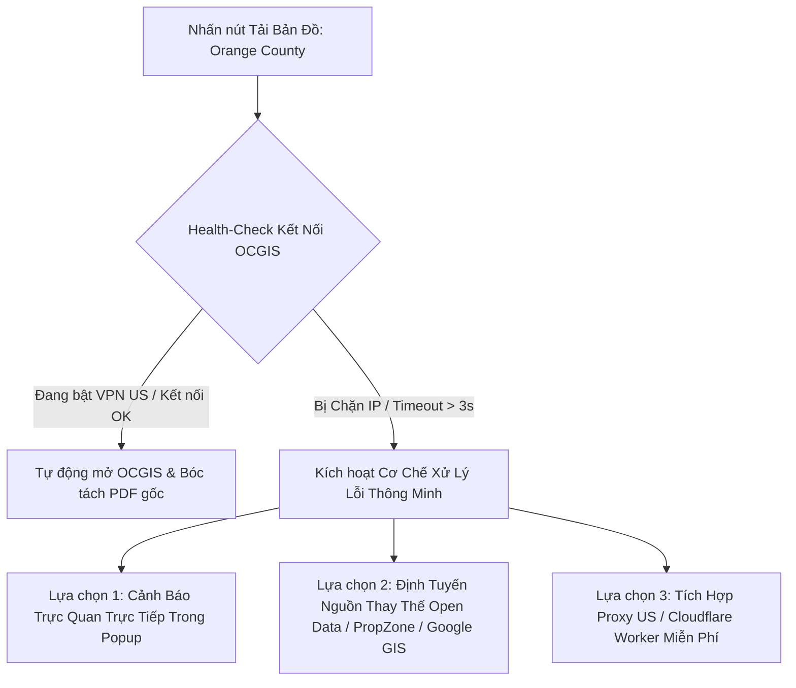

# Kế Hoạch Kỹ Thuật: Hệ Thống Bóc Tách & Tải Bản Đồ Đa Quận (County Map Downloader & Router)

Tài liệu này xác định kiến trúc, cơ chế định tuyến thông minh (Smart County Routing), phương thức bóc tách đường dẫn tải bản đồ (Plat Map / Assessor Parcel Map) từ 3 hệ thống chính quyền địa phương (Orange County, Riverside County, Los Angeles County), và giải pháp kỹ thuật toàn diện xử lý tình huống **chặn IP / yêu cầu VPN đối với Orange County**.

---

## 1. Phân Tích Hiện Trạng & Thách Thức Kỹ Thuật

### 1.1. Cấu Trúc Bản Đồ Của Từng Quận

| Quận (County) | Cổng Tra Cứu Chính Thức | Định Dạng Đầu Ra Bản Đồ | Cơ Chế Tải Xuống (Download Source) | Tình Trạng Kết Nối Mạng |
|---|---|---|---|---|
| **Orange County (CA)** | `https://webapps.ocgis.com/oclandinsights/map-viewer?id=2` | PDF Assessor Map / ArcGIS Web Map Image | Query theo APN -> Sinh URL PDF từ hệ thống OCGIS / Assessor | **Geo-blocked (Chặn IP ngoài Hoa Kỳ - Cần VPN US / Proxy)** |
| **County of Riverside** | `https://www.rivcoacr.org/` | PDF Assessor Plat Map (Book-Page) | Search APN -> Trích xuất link PDF từ cổng ACR Riverside | Mở tự do quốc tế |
| **Los Angeles County** | `https://portal.assessor.lacounty.gov/` | PDF Assessor Map Book / High-Res Vector | Search Parcel Number -> Call API `/api/parcel/map` -> Nhận PDF | Mở tự do quốc tế |
| **San Bernardino County (City of Ontario)** | `http://www.ci.ontario.ca.us/` & `https://www.arcgis.com/` | ArcGIS Web Map / Assessor Parcel Map | Search APN / City Portal -> Trích xuất Map | Mở tự do quốc tế |

---

## 2. Giải Pháp Xử Lý Vấn Đề "Orange County Buộc Phải Dùng VPN"

Trang `webapps.ocgis.com` và hạ tầng `ocgov.com` áp dụng bộ lọc tường lửa (Geo-IP Firewall) chặn toàn bộ truy cập từ ngoài lãnh thổ nước Mỹ. Để đảm bảo trải nghiệm liền mạch cho người dùng mà không bị treo hay báo lỗi vô định, chúng tôi thiết kế giải pháp **3 Lớp (Tri-Shield Strategy)**:



### Chi tiết 3 Phương Án Xử Lý:

#### Phương Án 1 (Khuyến Nghị V1): Chẩn Đoán Tự Động & Hướng Dẫn Bật VPN (Smart VPN Diagnostic & Assistant)
- **Cơ chế**: Trước khi kích hoạt luồng tải Orange County, Background Service Worker gửi một `fetch` thử nghiệm dạng ping (timeout 2.5s) tới `webapps.ocgis.com`.
- **Nếu phát hiện chặn IP (Network Error / Timeout)**:
  - Popup không bị treo mà hiển thị ngay badge thông báo:
    > `⚠️ Orange County yêu cầu IP US. Vui lòng bật VPN kết nối đến Server US rồi bấm "Thử Lại", hoặc dùng "Tải Bản Đồ Dự Phòng (PropZone/GIS)".`
  - Cung cấp nút 1-Click: `Mở Trực Tiếp OCGIS Trên Tab Mới` (để user xem trực tiếp sau khi bật VPN) và `Tải Bản Đồ Vệ Tinh Dự Phòng`.

#### Phương Án 2: Sử Dụng Cổng Dữ Liệu Mở Thay Thế (ArcGIS Open Data Hub)
- Orange County có các REST Service công khai trên ArcGIS Online / California Open Data không bị chặn Geo-IP (ví dụ các FeatureServer ranh giới thửa đất - Parcels).
- Khi không có VPN, hệ thống có thể chuyển sang trích xuất ảnh Snapshot thửa đất ranh giới đỏ từ ArcGIS REST Export Service hoặc bản đồ quy hoạch phân vùng PropZone Gridics.

#### Phương Án 3 (Nâng Cao): Micro-Proxy US Gateway
- Định tuyến các request tải PDF của riêng OCGIS qua một Cloudflare Worker hoặc Proxy server đặt tại US để bypass geo-blocking hoàn toàn tự động trong suốt với người dùng.

---

## 3. Kiến Trúc Điều Phối & Định Tuyến (County Router Architecture)

### 3.1. Sơ Đồ Khối Module Mới

```
FEASIBILITY STUDY Data/
├── config/
│   ├── county-detector.js       # Bổ sung cơ sở dữ liệu nhận diện & Router URL
│   └── map-sources.js           # [MỚI] Khai báo chi tiết Endpoints & Logic tải Map của từng Quận
├── content/
│   ├── ocgis-extractor.js       # [MỚI] Content script bóc tách link Map PDF trên OCGIS
│   ├── rivco-extractor.js       # [MỚI] Content script bóc tách link Map PDF trên RivCo ACR
│   └── la-assessor-extractor.js # [MỚI] Content script bóc tách link Map PDF trên LA Assessor
├── background/
│   └── service-worker.js        # Bổ sung Map Download Pipeline & VPN Health-Check
└── popup/
    ├── popup.html               # Nút "Download Parcel Map" thông minh + Modal trạng thái
    └── popup.js                 # Xử lý sự kiện click & kiểm tra trạng thái VPN
```

---

## 4. Đặc Tả Chi Tiết Cơ Chế Tải Bản Đồ Cho Từng Quận

### 4.1. Orange County (`webapps.ocgis.com`)
1. **Định dạng APN chuẩn**: 8 chữ số (ví dụ: `09638204` hoặc `096-382-04`).
2. **Luồng thực thi**:
   - Kiểm tra kết nối VPN US.
   - Mở URL: `https://webapps.ocgis.com/oclandinsights/map-viewer?id=2&apn={cleanAPN}`.
   - Script `ocgis-extractor.js` đợi widget Map tải xong -> bắt thẻ `<a>` chứa file PDF Assessor Map hoặc gọi REST API của OCGIS để lấy URL file PDF.
   - Kích hoạt `chrome.downloads.download` lưu file: `Orange_County_Parcel_Map_{APN}.pdf`.

### 4.2. Riverside County (`www.rivcoacr.org`)
1. **Định dạng APN chuẩn**: 9 chữ số (ví dụ: `123456789` dạng `123-456-789`).
2. **Luồng thực thi**:
   - Mở cổng tra cứu trực tiếp của Riverside County Assessor-County Clerk-Recorder (`rivcoacr.org` / GIS Portal).
   - Script `rivco-extractor.js` tự động điền APN vào ô tìm kiếm hoặc truy cập thẳng endpoint URL PDF theo quy tắc Book-Page-Parcel.
   - Bắt link PDF và kích hoạt tải về: `Riverside_County_Parcel_Map_{APN}.pdf`.

### 4.3. Los Angeles County (`portal.assessor.lacounty.gov`)
1. **Định dạng APN chuẩn**: 10 chữ số (ví dụ: `3111005016` dạng `3111-005-016`).
2. **Luồng thực thi**:
   - Mở URL: `https://portal.assessor.lacounty.gov/parceldetail/{cleanAPN}`.
   - Script `la-assessor-extractor.js` bắt API payload `/api/parcel/map?ain={cleanAPN}` hoặc click nút "Assessor Map (PDF)".
   - Bắt URL PDF và tải file: `LA_County_Assessor_Map_{APN}.pdf`.

---

## 5. Lộ Trình Triển Khai (Milestones)

- [ ] **Giai đoạn 1**: Xây dựng module `config/map-sources.js` cấu hình quy chuẩn 3 Quận & cơ chế chẩn đoán mạng (VPN Detector / Ping Health Check).
- [ ] **Giai đoạn 2**: Xây dựng Content Scripts bóc tách PDF Map chuyên biệt cho từng cổng (`ocgis-extractor.js`, `rivco-extractor.js`, `la-assessor-extractor.js`).
- [ ] **Giai đoạn 3**: Nâng cấp `background/service-worker.js` với `chrome.downloads` handler và cơ chế fallback khi Orange County mất kết nối US.
- [ ] **Giai đoạn 4**: Hoàn thiện UI nút `Download Parcel Map` trên `popup/popup.html` với hiệu ứng loading, cảnh báo VPN thông minh và tùy chọn tải map dự phòng.
