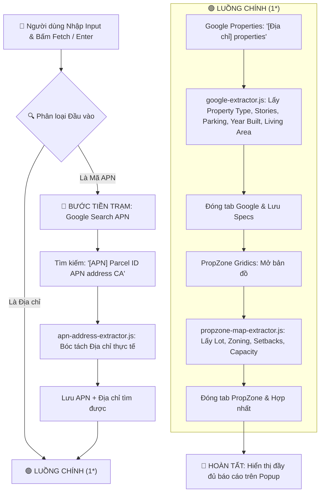

# KẾ HOẠCH TRIỂN KHAI: SÀNG LỌC ĐẦU VÀO (APN / ĐỊA CHỈ) & NỐI TIẾP LUỒNG TUẦN TỰ

## 1. Mục Tiêu
Cung cấp khả năng nhận diện thông minh tại ô nhập liệu duy nhất trên Popup Extension:
- **Nếu là Địa chỉ**: Chạy trực tiếp **Luồng chính (1\*)** [Google Overview $\rightarrow$ PropZone].
- **Nếu là Mã APN**: Tự động kích hoạt bước tiền trạm tra cứu Địa chỉ từ APN trên Google $\rightarrow$ Khi tìm thấy Địa chỉ sẽ **tự động chuyển tiếp vào Luồng chính (1\*)**.

---

## 2. Kiến Trúc Luồng Dữ Liệu (Pipeline Architecture)



---

## 3. Kế Hoạch Triển Khai Chi Tiết (Action Items)

### Giai đoạn 1: Phân loại đầu vào tại Popup & Background
1. **Tại `popup/popup.js` & `background/service-worker.js`**:
   - Sử dụng Regex chuẩn để nhận diện APN (chuỗi số 6-15 ký tự, có thể có dấu gạch ngang/khoảng trắng):
     ```javascript
     const isApn = /^[0-9\-\s]{6,16}$/.test(input.trim()) && /\d{6,}/.test(input.replace(/\D/g, ""));
     ```
   - Nếu là APN: Gửi request bắt đầu luồng `START_APN_PIPELINE` với `apn = cleanApn`.
   - Nếu là Địa chỉ: Gửi request `START_AUTO_PIPELINE` chạy thẳng vào Luồng (1\*).

### Giai đoạn 2: Tạo Content Script chuyên trách tìm Địa chỉ từ APN
1. **Tạo file mới `content/apn-address-extractor.js`**:
   - Tuân thủ nguyên tắc SRP (Single Responsibility Principle) và quy tắc giới hạn dòng (< 200 dòng).
   - Chỉ kích hoạt khi tab có `role: "APN_TO_ADDRESS_SEARCH"`.
   - Bóc tách địa chỉ chuẩn hóa US Address từ Snippets / Knowledge Panel của Google:
     - Regex bắt địa chỉ chuẩn: `[Số nhà] + [Tên đường] + [Thành phố] + CA + [Zipcode]`.
   - Khi tìm thấy: Gửi message `APN_ADDRESS_RESOLVED` `{ apn, address }` về Background Service Worker.

### Giai đoạn 3: Cập nhật Background Service Worker điều phối luồng
1. **Trong `background/service-worker.js`**:
   - Khởi chạy tab Google với query: `${apn} Parcel ID APN where is address California`.
   - Đánh dấu `apnSearchTabId`.
   - Lắng nghe sự kiện `APN_ADDRESS_RESOLVED`:
     - Lưu `pipelineSession.apn = apn`, `pipelineSession.address = foundAddress`.
     - Đóng tab tìm APN.
     - **Tái tiếp tục và gọi ngay `runDirectSearchPipeline(foundAddress)` (Luồng 1\*)**.

### Giai đoạn 4: Cập nhật `manifest.json` & Kiểm thử
1. Đăng ký `content/apn-address-extractor.js` vào `manifest.json`.
2. Kiểm thử:
   - Test Case 1: Nhập địa chỉ trực tiếp $\rightarrow$ Kiểm tra luồng (1\*).
   - Test Case 2: Nhập APN (ví dụ: `1049-441-21` hoặc `13343141`) $\rightarrow$ Kiểm tra bước tìm địa chỉ $\rightarrow$ Tự động chuyển tiếp luồng (1\*).
   - Test Case 3: Người dùng tự mở Google / PropZone bằng tay $\rightarrow$ Kiểm tra không bị tự động chạy ngầm.
